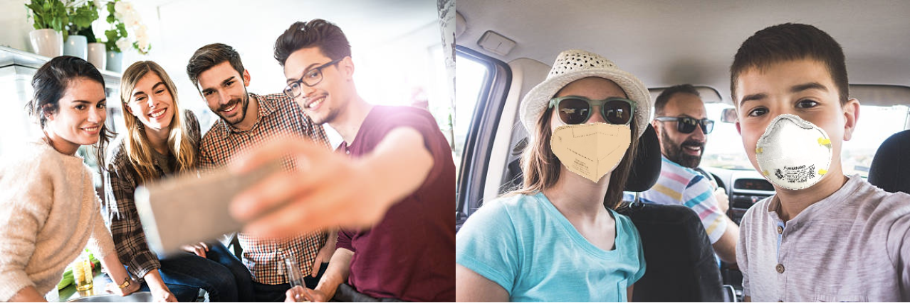

# Artificial Neural Networks and Deep Learning Challenges

This repository contains the scripts and the models that we created for the 3 challenges hosted by the [Artificial Neural Network and Deep Learning](http://chrome.ws.dei.polimi.it/index.php?title=Artificial_Neural_Networks_and_Deep_Learning) course at **Politecnico di Milano** in the academic year 2020-2021.

The Challenges focused on the following topics:
- Image Classification
- Image Segmentation
- Visual Question Answering

## Image Classification
The goal of this [Challenge](https://www.kaggle.com/c/artificial-neural-networks-and-deep-learning-2020/overview) was to classify images of people wearing masks into one of three classes:
- **Everyone** = all people in the image are wearing a mask
- **No one** = nobody in the image is wearing a mask
- **Someone** = some people in the image are wearing a mask but not all

**Dataset**:
- **5614** images in the training set
- **450** images in the test set 

**Evaluation Metric**:
- **Multiclass Accuracy**

**Final Score**:
- **0.9555**

**Final Position**:
- **27/193**

[Here](https://github.com/Menta99/an2dl-ali-menta-sorrentino/blob/master/Challenge%201%20-%20Image%20Classification/Report_Challenge_1.pdf) you can find a complete description of our approach.

## Image Segmentation
The goal of the [Challenge](https://competitions.codalab.org/competitions/27176) was to perform precise automatic crop and weed segmentation for the agricoltural sector.

The images contained two different crop types:
- **Mais**
- **Haricot** 

The segmented objects can belong to one of three classes:
- **Background**
- - label 0
- - RGB pixel [0, 0, 0] and [254, 124, 18]
- **Crop**
- - label 1
- - RGB pixel [255, 255, 255]
- **Weed**
- - label 2
- - RGB pixel [216, 67, 82]

**Dataset**:
- **4** different datasets of pictures and masks

**Evaluation Metric**:
- **Intersection over Union**

**Final Score**:
- **0.7400 (BipBip Maize)**

**Final Position**:
- **54/120 (BipBip Maize)**

[Here](https://github.com/Menta99/an2dl-ali-menta-sorrentino/blob/master/Challenge%202%20-%20Image%20Segmentation/Report_Challenge_2.pdf) you can find a complete description of our approach.

## Visual Question Answering
The goal of the [Challenge](https://www.kaggle.com/c/anndl-2020-vqa/overview) was to answer questions using the information provided by the corresponding image.

The given input was an image and an associated question about it, and the output was an answer, belonging to one of 3 possible categories: 
- **yes/no**
- **counting** (from 0 to 5)
- **other** (e.g. colors, location, ...)

**Dataset**:
- **29333** total images (400x700)
- **58832** questions in training set
- **6372** questions for testing

**Evaluation Metric**:
- **Multiclass Accuracy**

**Final Score**:
- **0.6360**

**Final Position**:
- **17/146**

[Here](https://github.com/Menta99/an2dl-ali-menta-sorrentino/blob/master/Challenge%203%20-%20Visual%20Question%20Answering/Report_Challenge_3.pdf) you can find a complete description of our approach.

## Group Members
- [Arslan Ali](https://github.com/arstek131)
- [Andrea Menta](https://github.com/Menta99)
- [Alessandro Sorrentino](https://github.com/sorre97)
